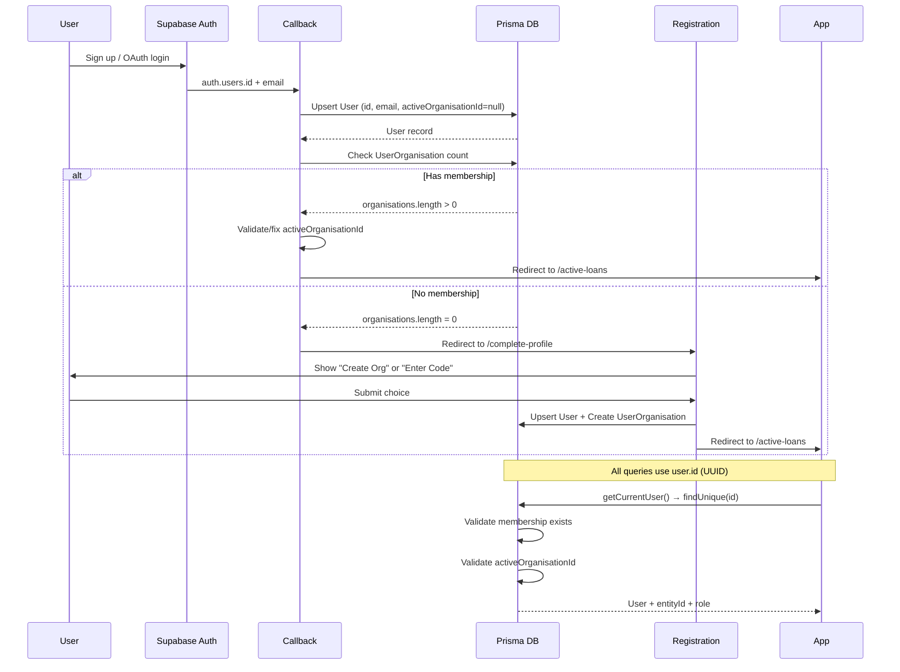

# Align Prisma User.id with Supabase Auth User ID

## Problem Analysis

**Current Issues:**

- Prisma generates independent `User.id` via `gen_random_uuid()`
- Supabase `auth.users.id` is fetched but never used
- All lookups use email (string comparison) instead of UUID
- No mechanism to handle email changes in Supabase
- `registerUser.ts` line 44 fetches `authUserId` but never inserts it

**Root Cause:** Two independent identity systems creating sync issues and performance bottlenecks.

## Solution Architecture

```mermaid
flowchart TD
    SupabaseAuth[Supabase Auth<br/>auth.users.id] -->|"Primary Identity"| PrismaUser[Prisma User<br/>id = auth.users.id]
    PrismaUser -->|"Cached"| Email[email]
    PrismaUser -->|"App-owned"| Name[name - editable]
    PrismaUser -->|"App-owned"| ActiveOrg[activeOrganisationId]
    PrismaUser -->|"App-owned"| Memberships[UserOrganisation[]]
```

## Implementation Steps

### 1. Update Prisma Schema

**File:** `[prisma/schema.prisma](prisma/schema.prisma)`Change User model:

```prisma
model User {
  id                   String             @id @db.Uuid  // Remove @default - set manually from Supabase
  email                String             @unique        // Cached from Supabase, synced on login
  name                 String?                          // App-owned, editable by user
  activeOrganisationId String?            @db.Uuid
  createdAt            DateTime           @default(now())
  updatedAt            DateTime           @updatedAt
  organisations        UserOrganisation[]
  activeOrganisation   Entity?            @relation("ActiveOrganisation", fields: [activeOrganisationId], references: [id])
  issueRecords         IssueRecord[]
  sentInvitations      Invitation[]

  @@index([activeOrganisationId])
}
```

**Key changes:**

- Remove `@default(dbgenerated("gen_random_uuid()"))` from `id` field
- Confirm `UserOrganisation.joinedAt` exists (used for deterministic ordering)
- Email remains `String @unique` (Supabase enforces uniqueness anyway, safe for MVP)

### 2. Create Migration

Since you're dev-only, we'll create a clean migration:

```bash
npx prisma migrate dev --name use_supabase_user_id
```

This will prompt about data loss (expected since we're changing PK strategy).

### 3. Update Registration Flow (Make Idempotent)

**File:** `[app/actions/registerUser.ts](app/actions/registerUser.ts)`**Critical: Change from `create` to `upsert**` to handle double-submits and race conditions.Changes at lines 43-80 (invitation flow) and 119-148 (new org flow):

```typescript
const authUserId = data.user?.id;
if (!authUserId) {
  return { error: 'Failed to get user ID from Supabase.' };
}

// INVITATION FLOW: Use upsert + atomic invitation consumption
if (inviteToken) {
  // ... validation ...

  await prisma.$transaction(async (tx) => {
    // Upsert user (idempotent)
    const user = await tx.user.upsert({
      where: { id: authUserId },
      create: {
        id: authUserId,
        email,
        activeOrganisationId: invitation.entityId,
      },
      update: {
        email, // Sync email if changed
        activeOrganisationId: invitation.entityId, // Set active org
      },
    });

    // CRITICAL: Atomically consume invitation (prevents double-accept race condition)
    const consumed = await tx.invitation.updateMany({
      where: {
        id: invitation.id,
        accepted: false, // Only update if not already accepted
      },
      data: { accepted: true },
    });

    if (consumed.count === 0) {
      throw new Error('This invitation has already been used.');
    }

    // CRITICAL: Upsert membership (idempotent - handles retries)
    await tx.userOrganisation.upsert({
      where: {
        userId_organisationId: {
          userId: user.id,
          organisationId: invitation.entityId,
        },
      },
      create: {
        userId: user.id,
        organisationId: invitation.entityId,
        role: invitation.role,
      },
      update: {
        // On retry, role doesn't change (invitation is immutable)
      },
    });
  });

  return { success: true, joined: true, organizationName: invitation.entity.name };
}

// NEW ORG FLOW: Use upsert instead of create
await prisma.$transaction(async (tx) => {
  // Generate and encrypt entity key
  const entityKey = generateEntityKey();
  const encryptedKey = encryptEntityKey(entityKey);

  // Create entity
  const entity = await tx.entity.create({
    data: {
      name: entityName,
      encryptionKey: encryptedKey,
    },
  });

  // Upsert user (idempotent)
  const user = await tx.user.upsert({
    where: { id: authUserId },
    create: {
      id: authUserId,
      email,
      activeOrganisationId: entity.id,
    },
    update: {
      email, // Sync email if changed
      activeOrganisationId: entity.id, // Set active org
    },
  });

  // CRITICAL: Upsert membership (idempotent - handles retries)
  await tx.userOrganisation.upsert({
    where: {
      userId_organisationId: {
        userId: user.id,
        organisationId: entity.id,
      },
    },
    create: {
      userId: user.id,
      organisationId: entity.id,
      role: 'OWNER',
    },
    update: {
      // On retry, role doesn't change
    },
  });
});
```

**Key improvements:**

- ✅ Uses `upsert` for User (handles retries/double-submits)
- ✅ **CRITICAL**: Uses `upsert` for UserOrganisation (not `create`) - prevents P2002 errors on retry
- ✅ **CRITICAL**: Atomic invitation consumption via `updateMany` with `where: { accepted: false }` - prevents race conditions
- ✅ Sets activeOrganisationId immediately upon org creation/joining

### 4. Implement Smart Callback Upsert (Always Create User, Check Membership)

**File:** `[app/auth/callback/route.ts](app/auth/callback/route.ts)`**Philosophy:** Always upsert a minimal user record (even for new users), but base authorization on **membership**, not just `activeOrganisationId`.Replace database lookups (lines 49-76) with this pattern:

```typescript
// After successful auth.exchangeCodeForSession and getUser()
const email = user.email;
const supabaseUserId = user.id;

if (!email) {
  return NextResponse.redirect(new URL('/auth/login?error=no_email', req.url));
}

// ALWAYS upsert user (new or returning)
// This creates a minimal record without granting org access
const userRecord = await prisma.user.upsert({
  where: { id: supabaseUserId },
  create: {
    id: supabaseUserId,
    email: email,
    name: user.user_metadata?.full_name || null,
    activeOrganisationId: null, // No org assigned yet
  },
  update: {
    email: email, // Sync email changes for returning users
    // name is NOT synced - user controls it in app
  },
  select: {
    activeOrganisationId: true,
    organisations: {
      select: {
        organisationId: true,
        organisation: {
          select: { id: true, name: true },
        },
      },
      orderBy: { joinedAt: 'asc' }, // CRITICAL: Deterministic ordering
    },
  },
});

// Check membership count (this is authorization, not authentication)
const membershipCount = userRecord.organisations.length;

if (membershipCount === 0) {
  // No memberships = needs to create org or use invitation
  return NextResponse.redirect(new URL('/auth/complete-profile', req.url));
}

// Has memberships - ensure activeOrganisationId is valid
if (
  !userRecord.activeOrganisationId ||
  !userRecord.organisations.some((o) => o.organisationId === userRecord.activeOrganisationId)
) {
  // activeOrganisationId is null or stale, set to first org
  const firstOrg = userRecord.organisations[0];
  await prisma.user.update({
    where: { id: supabaseUserId },
    data: { activeOrganisationId: firstOrg.organisationId },
  });
}

// User has valid membership and active org
if (type === 'recovery') {
  return NextResponse.redirect(new URL('/auth/reset-password', req.url));
}

return NextResponse.redirect(new URL(next, req.url));
```

**Key improvements:**

- ✅ Always creates user record (eliminates "USER_NOT_IN_DB" fragility)
- ✅ Authorization based on **membership**, not just activeOrganisationId
- ✅ Handles stale/null activeOrganisationId by picking first org (deterministically ordered)
- ✅ Security maintained: membership required for access, not just user existence
- ✅ OAuth auto-provisioning: Google users get full_name from metadata (one-time default)
- ✅ **CRITICAL**: Uses `orderBy: { joinedAt: 'asc' }` for deterministic "first org" selection

**Note on `name` field:**

- `create` populates from OAuth metadata (one-time default for convenience)
- `update` does NOT overwrite (user controls it in app settings)
- This is intentional: OAuth provides sensible default, user can customize later

### 5. Update getCurrentUser() - ID-based Lookup + Membership Validation

**File:** `[lib/auth-utils.ts](lib/auth-utils.ts)`Optimize lookup from email-based to ID-based, and add membership validation (lines 34-106):

```typescript
export const getCurrentUser = cache(async (): Promise<CurrentUser> => {
  const supabase = await createClient();
  const {
    data: { user },
    error,
  } = await supabase.auth.getUser();

  if (error || !user) {
    throw new Error('Not authenticated');
  }

  // CHANGE: Lookup by Supabase user.id instead of email
  const dbUser = await prisma.user.findUnique({
    where: { id: user.id }, // UUID lookup (was: email string comparison)
    select: {
      id: true,
      email: true,
      name: true,
      activeOrganisationId: true,
      organisations: {
        include: {
          organisation: {
            select: { id: true, name: true },
          },
        },
        orderBy: { joinedAt: 'asc' }, // CRITICAL: Deterministic ordering
      },
    },
  });

  if (!dbUser) {
    // User exists in Supabase but not in Prisma
    // With new flow this should rarely happen (callback upserts everyone)
    throw new Error('USER_NOT_IN_DB');
  }

  // CHANGE: Validate membership exists (authorization check)
  if (dbUser.organisations.length === 0) {
    throw new Error('USER_HAS_NO_ORGANISATIONS');
  }

  // CHANGE: Validate activeOrganisationId (but don't fix it here - callback handles that)
  let activeOrgId = dbUser.activeOrganisationId;

  // If null or not in current memberships, use first org (deterministic due to orderBy)
  if (!activeOrgId || !dbUser.organisations.some((o) => o.organisationId === activeOrgId)) {
    const firstOrg = dbUser.organisations[0];
    activeOrgId = firstOrg.organisationId;

    // NOTE: We don't update the DB here because getCurrentUser() is cached.
    // Callback route handles fixing stale activeOrganisationId on login.
    // This ensures the user can proceed even if activeOrganisationId is stale.
  }

  // Find the role in the active organisation
  const activeOrgRelation = dbUser.organisations.find((o) => o.organisationId === activeOrgId);

  if (!activeOrgRelation) {
    // Should never happen after the checks above, but safety
    throw new Error('ACTIVE_ORG_NOT_IN_MEMBERSHIPS');
  }

  return {
    id: dbUser.id,
    email: dbUser.email,
    name: dbUser.name,
    entityId: activeOrgId,
    roleInActiveOrg: activeOrgRelation.role,
    allOrganisations: dbUser.organisations.map((o) => ({
      id: o.organisationId,
      name: o.organisation.name,
      role: o.role,
    })),
  };
});
```

**Key improvements:**

- ✅ UUID lookup instead of email string comparison (performance)
- ✅ Validates membership exists (authorization)
- ✅ Handles stale/null activeOrganisationId (falls back to first org)
- ✅ **CRITICAL**: Uses `orderBy: { joinedAt: 'asc' }` for deterministic ordering
- ✅ **Does NOT mutate DB** inside cached function (avoids caching issues)
- ✅ Robust to org membership changes (user removed from org)

### 6. Update Other Auth Checks

**File:** `[app/actions/updateProfile.ts](app/actions/updateProfile.ts)`Change lookup from email to ID (line 23-28):

```typescript
// BEFORE:
await prisma.user.update({
  where: { email }, // String comparison
  data: { name: name || undefined },
});

// AFTER:
await prisma.user.update({
  where: { id: user.id }, // UUID lookup
  data: { name: name || undefined },
});
```

### 7. Add Helper Queries for Membership Checking

**File:** `[lib/auth-utils.ts](lib/auth-utils.ts)`Add utility functions for common membership operations:

```typescript
/**
 * Check if user has any organisation memberships
 */
export async function hasMembership(userId: string): Promise<boolean> {
  const count = await prisma.userOrganisation.count({
    where: { userId },
  });
  return count > 0;
}

/**
 * Get user's first organisation (for default selection)
 */
export async function getFirstOrganisation(userId: string): Promise<string | null> {
  const membership = await prisma.userOrganisation.findFirst({
    where: { userId },
    select: { organisationId: true },
    orderBy: { joinedAt: 'asc' },
  });
  return membership?.organisationId || null;
}

/**
 * Validate user has access to specific organisation
 */
export async function hasAccessToOrg(userId: string, orgId: string): Promise<boolean> {
  const membership = await prisma.userOrganisation.findUnique({
    where: {
      userId_organisationId: { userId, organisationId: orgId },
    },
  });
  return !!membership;
}
```

### 8. Add Display Name Editor in Settings

**New File:** `app/(dashboard)/settings/profile/page.tsx`Allow users to edit their display name:

```typescript
'use client';
import { useState } from 'react';
import { Button } from '@/components/ui/button';
import { Input } from '@/components/ui/input';

export default function ProfileSettings() {
  // Form to edit user.name (display name)
  // Separate from email (managed by Supabase)
  // Show email as read-only (managed in Supabase Auth settings)
}
```

## Updated Architecture: Authentication ≠ Authorization

**Critical principle:** Callback creates user record, but **membership grants access**.

```mermaid
flowchart TD
    Login[User Login] -->|Email/OAuth| Auth[Supabase Auth]
    Auth --> Callback[Callback Route]
    Callback --> Upsert[Always Upsert User<br/>id, email, name]
    Upsert --> CheckMembership{Has UserOrganisation<br/>membership?}

    CheckMembership -->|No| CompleteProfile[/auth/complete-profile]
    CheckMembership -->|Yes| ValidateActiveOrg{activeOrganisationId<br/>valid?}

    ValidateActiveOrg -->|Yes| Dashboard[/active-loans]
    ValidateActiveOrg -->|No/Null| SetDefault[Set to first org]
    SetDefault --> Dashboard

    CompleteProfile --> UserChoice{User Action}
    UserChoice -->|Create Org| RegisterNewOrg[registerUser<br/>creates org + membership]
    UserChoice -->|Enter Code| RegisterInvite[registerUser<br/>joins via invitation]

    RegisterNewOrg --> Membership1[UserOrganisation<br/>role = OWNER]
    RegisterInvite --> Membership2[UserOrganisation<br/>role = from invitation]

    Membership1 --> Dashboard
    Membership2 --> Dashboard

    style Upsert fill:#e1f5e1
    style CheckMembership fill:#fff3cd
    style Membership1 fill:#cfe2ff
    style Membership2 fill:#cfe2ff
```

## Data Flow After Migration



## Architecture Refinements (Based on Security Review)

### 1. Always Upsert User in Callback

**Why:** Eliminates "USER_NOT_IN_DB" fragility without compromising security.

- Callback creates minimal user record (id + email + name)
- No `activeOrganisationId` set = no access granted
- Authorization still gated by `UserOrganisation` membership

### 2. Membership-Based Authorization

**Why:** `activeOrganisationId` is a preference, not proof of access.

- User might be removed from org (membership deleted, but activeOrganisationId remains)
- User might have memberships but null activeOrganisationId (first login edge case)
- Solution: Always validate membership exists before granting access

### 3. Idempotent Registration

**Why:** Prevents errors on retries, double-submits, back-button clicks.

- Use `upsert` instead of `create` for User
- `@@unique([userId, organisationId])` prevents duplicate memberships automatically
- Safe to call registration multiple times with same data

### 4. Email as Cached Field

**Why:** Keep for convenience, but don't rely on it for identity.

- Invitation matching still uses email (required for BRF use case)
- Display in team lists, issue records
- Sync from Supabase on every login (handles email changes)
- Primary identity is always Supabase user.id

## Benefits

✅ **Single source of truth**: Supabase user.id = Prisma User.id✅ **Performance**: UUID lookups instead of email string comparison✅ **Email resilience**: Email changes in Supabase sync automatically✅ **Clean separation**: Auth (Supabase) vs. app data (Prisma)✅ **Multi-tenant security**: Authorization via UserOrganisation, not just User existence✅ **Robust to edge cases**: Handles stale activeOrganisationId, membership removal✅ **Idempotent**: Registration flows handle retries/double-submits gracefully✅ **User-friendly**: Editable display names independent of email provider✅ **Open creation**: Anyone can create orgs or join via invitation (MVP freedom)

## Testing Checklist

### Happy Paths

- New user registration creates User with Supabase ID
- OAuth login (Google) upserts user with full_name from metadata
- Email confirmation flow upserts user
- User can create new organisation (becomes OWNER)
- User can join via invitation code (gets correct role)
- getCurrentUser() returns correct user with valid membership
- Team member lists show display names
- User can edit display name in settings
- IssueRecords reference correct userId

### Edge Cases & Security

- **Idempotency**: Double-submit registration doesn't error
- **Membership validation**: User without membership redirected to complete-profile
- **Stale activeOrganisationId**: Auto-fixed to first org on login
- **Removed from org**: User removed from all orgs redirected to complete-profile
- **Email change**: User changes email in Supabase, syncs on next login
- **Null activeOrganisationId**: getCurrentUser() sets to first org
- **Invalid invitation**: Expired/used/wrong-email invitation rejected
- **Duplicate membership**: Joining same org twice handled gracefully
- **OAuth without org**: Google login creates user but requires org selection
- **Back button**: Navigating back during registration doesn't break state

## Key Security Principles

### 1. Authentication ≠ Authorization

```typescript
// ✅ CORRECT: Anyone can authenticate (Supabase)
const { user } = await supabase.auth.getUser();

// ✅ CORRECT: But only members can access data (Prisma)
const membership = await prisma.userOrganisation.findFirst({
  where: { userId: user.id, organisationId: entityId },
});
if (!membership) throw new Error('Access denied');
```

### 2. activeOrganisationId is a Preference, Not Authorization

```typescript
// ❌ WRONG: Trusting activeOrganisationId without validation
const data = await prisma.keyType.findMany({
  where: { entityId: user.activeOrganisationId }, // User might be removed!
});

// ✅ CORRECT: Validate membership first
const user = await getCurrentUser(); // This validates membership exists
const data = await prisma.keyType.findMany({
  where: { entityId: user.entityId }, // Safe: getCurrentUser() ensures valid membership
});
```

### 3. Always Use Upsert for User Creation

```typescript
// ❌ WRONG: Breaks on retry/double-submit
const user = await prisma.user.create({
  data: { id: authUserId, email },
});

// ✅ CORRECT: Idempotent
const user = await prisma.user.upsert({
  where: { id: authUserId },
  create: { id: authUserId, email },
  update: { email },
});
```

## Critical Fixes Applied (Production-Essential)

### 1. UserOrganisation Creation is Now Truly Idempotent ✅

**Problem:** Original plan used `create()` which throws `P2002` on retry despite `@@unique` constraint.**Solution:** Changed to `upsert()` with composite unique key:

```typescript
await tx.userOrganisation.upsert({
  where: {
    userId_organisationId: { userId, organisationId },
  },
  create: { userId, organisationId, role },
  update: {}, // On retry, no changes needed
});
```

### 2. Atomic Invitation Consumption ✅

**Problem:** Two concurrent accepts could both see `accepted: false` and proceed (race condition).**Solution:** Use `updateMany` with conditional where clause:

```typescript
const consumed = await tx.invitation.updateMany({
  where: { id: invitation.id, accepted: false },
  data: { accepted: true },
});
if (consumed.count === 0) {
  throw new Error('Invitation already used');
}
```

### 3. Deterministic "First Org" Selection ✅

**Problem:** Array order without `orderBy` is unstable, could pick different orgs on different requests.**Solution:** Always order by `joinedAt: 'asc'` in all membership queries:

```typescript
organisations: {
  select: { ... },
  orderBy: { joinedAt: 'asc' }  // Consistent "first org"
}
```

### 4. No DB Mutation in Cached Functions ✅

**Problem:** Original plan updated `activeOrganisationId` inside `getCurrentUser()` which is wrapped in `React.cache()`.**Solution:**

- Callback route fixes stale `activeOrganisationId` on login
- `getCurrentUser()` only reads and falls back to first org (no DB writes)
- Avoids caching issues while maintaining robustness

### 5. Email Uniqueness Strategy Clarified ✅

**Decision:** Keep `email String @unique` because:

- Supabase enforces email uniqueness by default
- Invitation matching relies on email
- MVP scope is safe (no multi-auth-provider edge cases)
- If needed later, can be relaxed to `email String? @unique`

## What Changed From Original Plan

### Original Approach (Issues)

- Callback didn't create users (caused "USER_NOT_IN_DB" everywhere)
- Redirected based only on activeOrganisationId (insecure)
- Used `create` in registration (broke on retries)
- Didn't validate membership in getCurrentUser()

### Refined Approach (Secure)

- ✅ Callback always upserts minimal user record
- ✅ Redirects based on UserOrganisation membership count
- ✅ Uses `upsert` in all registration flows (idempotent)
- ✅ getCurrentUser() validates membership and activeOrganisationId
- ✅ Helper functions for membership checking
- ✅ Handles edge cases: stale activeOrg, membership removal, email changes

## Migration Notes

Since you're dev-only:

- Existing data will be lost (acceptable)
- No need for data migration scripts
- Can test with fresh Supabase users
- If you need to preserve test data, let me know and I'll add a migration script

## Final Review Summary

### ✅ What's Solid (Keeping)

1. **Identity alignment**: Prisma User.id = Supabase auth.users.id (canonical identity)
2. **Auth ≠ Authorization**: Access gated by UserOrganisation membership
3. **ID-based lookups**: UUID instead of email (performance + correctness)
4. **Callback always upserts**: Minimal user record without granting org access
5. **Active org validation**: Treats activeOrganisationId as preference, validates/fixes if stale

### 🔧 Critical Fixes Applied

1. **UserOrganisation upsert** (not `create`) - prevents P2002 on retry
2. **Atomic invitation consumption** - `updateMany` with `where: { accepted: false }` prevents race conditions
3. **Deterministic org ordering** - `orderBy: { joinedAt: 'asc' }` everywhere
4. **No mutation in cached function** - `getCurrentUser()` doesn't update DB
5. **Email strategy clarified** - Kept `String @unique` (safe for MVP scope)

### 🎯 Production-Ready Checklist

- Idempotent user creation (upsert)
- Idempotent membership creation (upsert)
- Race-safe invitation consumption (atomic updateMany)
- Deterministic first-org selection (ordered by joinedAt)
- Membership-based authorization (not just activeOrganisationId)
- Stale activeOrg handling (callback fixes, getCurrentUser reads)
- Email change resilience (synced on every login)
- OAuth name handling (one-time default, user-editable)

### 🚀 Ready to Execute

This plan is now production-hardened against:

- Double-submits and retries
