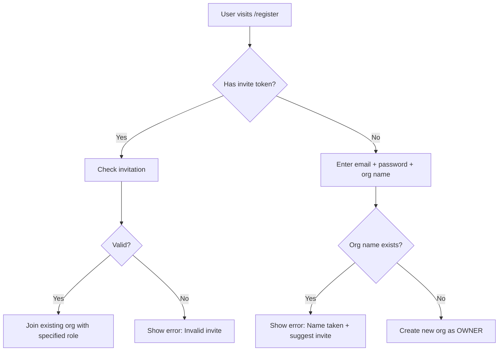

# SaaS Multi-Tenant Workflow Audit

## 🎯 Current State vs Standard SaaS Patterns

### ✅ What's Working Well

#### 1. **Registration Flow** ✅
**Current**: First user creates organization and becomes OWNER

```typescript
// app/actions/registerUser.ts
// ✅ GOOD: Creates Entity + User in transaction
await prisma.$transaction(async (tx) => {
  const entity = await tx.entity.create({
    data: { name: entityName, encryptionKey: encrypted }
  });
  
  await tx.user.create({
    data: {
      email,
      entityId: entity.id,
      role: 'OWNER',  // ← First user is owner
    },
  });
});
```

**Standard SaaS Pattern**: ✅ Matches perfectly
- First signup = new organization
- Automatic OWNER role
- Entity name must be unique

#### 2. **Data Isolation** ✅
**Current**: All queries filter by `entityId`

```typescript
// ✅ GOOD: Automatic data isolation
const { entityId } = await getCurrentUser();
const keys = await prisma.keyType.findMany({
  where: { entityId },  // Only this org's data
});
```

**Standard SaaS Pattern**: ✅ Perfect implementation

#### 3. **Role-Based Access** ✅
**Current**: Three-tier role hierarchy

```typescript
enum UserRole {
  OWNER   // Full control
  ADMIN   // Manage operations
  MEMBER  // View and use
}
```

**Standard SaaS Pattern**: ✅ Standard B2B SaaS model

---

## ❌ Missing SaaS Features

### 1. **Team Management** ❌

#### Current State
- ❌ No way to invite users to existing organization
- ❌ No user management UI
- ❌ OWNER can't add ADMIN/MEMBER users
- ❌ Users can't see team members

#### Standard SaaS Pattern
```typescript
// What we need:
model Invitation {
  id        String   @id @default(uuid())
  entityId  String   // Which org
  email     String   // Who to invite
  role      UserRole // What role
  token     String   @unique // Secure invite link
  expiresAt DateTime
  accepted  Boolean  @default(false)
  createdBy String   // User who sent invite
}
```

**Priority**: 🔴 **HIGH** - Core SaaS feature

**Use Case**: 
- Board chairman (OWNER) wants to add board members (ADMIN)
- Board wants to add residents who can book keys (MEMBER)

---

### 2. **Registration Flow Enhancement** ⚠️

#### Current Issue
```typescript
// app/actions/registerUser.ts
if (existingEntity) {
  return { error: 'Organization name already exists.' };
}
// ❌ User can't join existing organization
```

#### What Should Happen (Standard SaaS)



**What we need**:
```typescript
// Enhanced registration flow
export async function registerUser(formData: FormData) {
  const email = formData.get('email') as string;
  const password = formData.get('password') as string;
  const entityName = formData.get('entityName') as string;
  const inviteToken = formData.get('inviteToken') as string; // NEW
  
  // 1. Sign up with Supabase
  const { data, error } = await supabase.auth.signUp({ email, password });
  
  // 2. Check for pending invitation
  if (inviteToken) {
    const invitation = await prisma.invitation.findUnique({
      where: { token: inviteToken, email, accepted: false },
    });
    
    if (invitation && invitation.expiresAt > new Date()) {
      // Join existing organization
      await prisma.user.create({
        data: {
          email,
          entityId: invitation.entityId,
          role: invitation.role,  // Use invited role
        },
      });
      
      await prisma.invitation.update({
        where: { id: invitation.id },
        data: { accepted: true },
      });
      
      return { success: true, joined: true };
    }
  }
  
  // 3. Create new organization (existing logic)
  const existingEntity = await prisma.entity.findUnique({
    where: { name: entityName },
  });
  
  if (existingEntity) {
    return { 
      error: 'Organization name already exists. If you were invited, use your invite link.',
    };
  }
  
  // Create entity + owner user...
}
```

**Priority**: 🔴 **HIGH** - Blocks team features

---

### 3. **Settings/Profile Pages** ⚠️

#### Current State
- ✅ Has profile update for name
- ❌ No organization settings page
- ❌ No way to view/edit organization name
- ❌ No way to manage users
- ❌ No way to view billing (future)

#### Standard SaaS Pattern Needed

**Organization Settings** (`/settings/organization`)
```typescript
// View organization details
const org = await prisma.entity.findUnique({
  where: { id: user.entityId },
  include: {
    users: {
      select: { 
        id, email, name, role, createdAt 
      },
      orderBy: { createdAt: 'asc' },
    },
  },
});

// UI shows:
// - Organization name (editable by OWNER)
// - List of team members with roles
// - Invite new member button (OWNER/ADMIN only)
// - Remove member button (OWNER only)
```

**User Settings** (`/settings/profile`)
```typescript
// Current: ✅ Has basic name update
// Missing:
// - Email change (requires Supabase update)
// - Password change
// - 2FA setup (future)
```

**Priority**: 🟡 **MEDIUM** - Important for usability

---

### 4. **Onboarding Experience** ⚠️

#### Current State
```typescript
// app/auth/callback/route.ts
// After successful login:
if (!userRecord || !userRecord.entityId) {
  return NextResponse.redirect('/auth/complete-profile');
}
return NextResponse.redirect('/active-loans');
```

**Issue**: No onboarding for new organization owners

#### Standard SaaS Pattern

**First Login Flow (OWNER)**:
1. ✅ Registration successful
2. ❌ **Missing**: Welcome modal explaining:
   - You're the owner of [Organization]
   - Here's how to invite team members
   - Quick tour of key features
3. ❌ **Missing**: Checklist/Getting Started guide:
   - [ ] Add first key type
   - [ ] Create key copies
   - [ ] Invite team members
   - [ ] Issue first key

**Priority**: 🟢 **LOW** - Nice to have, not blocking

---

### 5. **Permission Guards** ⚠️

#### Current State
```typescript
// lib/auth-utils.ts
export async function hasRole(requiredRole: UserRole): Promise<boolean> {
  // ✅ EXISTS: Role checking function
}

export async function requireRole(requiredRole: UserRole): Promise<void> {
  // ✅ EXISTS: Throws if insufficient role
}
```

**Issue**: Not consistently used in actions

#### What's Needed

```typescript
// Example: Only OWNER/ADMIN should delete key types
export async function deleteKeyType(id: string) {
  const user = await getCurrentUser();
  
  // ❌ MISSING: Role check
  if (!['OWNER', 'ADMIN'].includes(user.role)) {
    return { success: false, error: 'Permission denied' };
  }
  
  // Existing deletion logic...
}
```

**Required Audit**: Check all server actions for appropriate role guards

**Priority**: 🔴 **HIGH** - Security issue

---

### 6. **User Management UI** ❌

#### Completely Missing

**What's Needed**: `/settings/team` page

**Features**:
1. **List Team Members**
   ```typescript
   const teamMembers = await prisma.user.findMany({
     where: { entityId: user.entityId },
     select: { id, email, name, role, createdAt },
     orderBy: { createdAt: 'asc' },
   });
   ```

2. **Invite New Member** (OWNER/ADMIN only)
   - Form with email + role selection
   - Generates invite token
   - Sends email with invite link
   - `/register?token=abc123`

3. **Change User Role** (OWNER only)
   - Dropdown to change role
   - Can't demote yourself (prevent lockout)

4. **Remove User** (OWNER only)
   - Delete user from organization
   - Transfer their audit trail records
   - Can't remove yourself (prevent lockout)

**Priority**: 🔴 **HIGH** - Core SaaS feature

---

## 📋 Implementation Roadmap

### Phase 1: Core Team Features (HIGH Priority)

#### 1.1 Database Schema
```prisma
model Invitation {
  id        String   @id @default(uuid())
  entityId  String   @db.Uuid
  email     String
  role      UserRole
  token     String   @unique
  expiresAt DateTime
  accepted  Boolean  @default(false)
  createdBy String   @db.Uuid
  createdAt DateTime @default(now())
  
  entity  Entity @relation(fields: [entityId], references: [id], onDelete: Cascade)
  inviter User   @relation(fields: [createdBy], references: [id])
  
  @@index([entityId])
  @@index([token])
  @@index([email])
}

// Add to Entity model
model Entity {
  // ...existing fields
  invitations Invitation[]
}

// Add to User model
model User {
  // ...existing fields
  sentInvitations Invitation[]
}
```

#### 1.2 Server Actions
```typescript
// app/actions/team.ts
export async function inviteUser(email: string, role: UserRole) {
  const user = await getCurrentUser();
  await requireRole('OWNER'); // Or ADMIN for MEMBER invites
  
  // Generate invite
  const token = crypto.randomBytes(32).toString('hex');
  const invitation = await prisma.invitation.create({
    data: {
      entityId: user.entityId,
      email,
      role,
      token,
      expiresAt: addDays(new Date(), 7),
      createdBy: user.id,
    },
  });
  
  // Send email with invite link
  await sendInviteEmail(email, token, user.entity.name);
  
  return { success: true, inviteId: invitation.id };
}

export async function listTeamMembers() {
  const user = await getCurrentUser();
  return await prisma.user.findMany({
    where: { entityId: user.entityId },
    select: { id, email, name, role, createdAt },
    orderBy: { role: 'asc' }, // OWNER first
  });
}

export async function changeUserRole(userId: string, newRole: UserRole) {
  const currentUser = await getCurrentUser();
  await requireRole('OWNER');
  
  if (userId === currentUser.id) {
    return { success: false, error: "Can't change your own role" };
  }
  
  await prisma.user.update({
    where: { id: userId, entityId: currentUser.entityId },
    data: { role: newRole },
  });
  
  return { success: true };
}

export async function removeUser(userId: string) {
  const currentUser = await getCurrentUser();
  await requireRole('OWNER');
  
  if (userId === currentUser.id) {
    return { success: false, error: "Can't remove yourself" };
  }
  
  await prisma.user.delete({
    where: { id: userId, entityId: currentUser.entityId },
  });
  
  return { success: true };
}
```

#### 1.3 UI Pages
- `app/(dashboard)/settings/team/page.tsx` - Team management
- `app/(dashboard)/settings/organization/page.tsx` - Org settings
- Update registration to handle invite tokens

### Phase 2: Permission Guards (HIGH Priority)

Audit and add role checks to:
- ✅ `createKeyType` - All roles allowed
- ⚠️ `deleteKeyType` - Only OWNER/ADMIN
- ⚠️ `updateKeyType` - Only OWNER/ADMIN
- ⚠️ `addKeyCopy` - Only OWNER/ADMIN
- ✅ `issueKey` - All roles allowed
- ✅ `returnKey` - All roles allowed
- ⚠️ Entity settings - Only OWNER

### Phase 3: Enhanced UX (MEDIUM Priority)

- Settings navigation in sidebar
- User dropdown showing role
- Organization name in header
- Getting started checklist
- Better error messages

### Phase 4: Advanced Features (LOW Priority)

- Email notifications
- Activity audit log
- 2FA support
- SSO integration
- Billing/subscription

---

## 🎯 Quick Wins (Immediate Actions)

### 1. Add Role Guards (1-2 hours)
```typescript
// Add to app/actions/keyTypes.ts
export async function deleteKeyType(id: string) {
  const user = await getCurrentUser();
  
  // NEW: Role check
  if (!['OWNER', 'ADMIN'].includes(user.role)) {
    return { success: false, error: 'Only owners and admins can delete key types' };
  }
  
  // Existing logic...
}
```

### 2. Better Registration Message (15 min)
```typescript
// app/actions/registerUser.ts
if (existingEntity) {
  return { 
    error: 'This organization name is already taken. If you were invited to join, please use your invitation link. Otherwise, choose a different name.',
  };
}
```

### 3. Show Role in UI (30 min)
```typescript
// components/shared/dashboard-sidebar.tsx
<div className="flex flex-col gap-0.5">
  <span className="text-base font-semibold">{entityName}</span>
  <span className="text-xs text-muted-foreground capitalize">
    {userRole.toLowerCase()} {/* Show user's role */}
  </span>
</div>
```

---

## 📊 Compliance with SaaS Patterns

| Feature | Standard SaaS | Current Status | Priority |
|---------|---------------|----------------|----------|
| **First user = OWNER** | ✅ Required | ✅ Implemented | - |
| **Data isolation by org** | ✅ Required | ✅ Implemented | - |
| **Role-based permissions** | ✅ Required | ⚠️ Partial | 🔴 HIGH |
| **Team invitations** | ✅ Required | ❌ Missing | 🔴 HIGH |
| **User management UI** | ✅ Required | ❌ Missing | 🔴 HIGH |
| **Organization settings** | ✅ Required | ❌ Missing | 🟡 MEDIUM |
| **Email notifications** | ⚠️ Optional | ❌ Missing | 🟢 LOW |
| **Audit log** | ⚠️ Optional | ⚠️ Partial (IssueRecord.userId) | 🟢 LOW |
| **Onboarding flow** | ⚠️ Optional | ❌ Missing | 🟢 LOW |

---

## 🚀 Recommended Next Steps

1. **Add Role Guards** (HIGH, 2 hours)
   - Audit all server actions
   - Add permission checks
   - Test with different roles

2. **Implement Invitations** (HIGH, 1 day)
   - Add Invitation model
   - Create invite actions
   - Update registration flow
   - Email sending (can use console log for now)

3. **Build Team Management UI** (HIGH, 1 day)
   - `/settings/team` page
   - List members
   - Invite form
   - Role management

4. **Organization Settings** (MEDIUM, half day)
   - `/settings/organization` page
   - View/edit org name
   - Basic settings

5. **Enhanced UX** (MEDIUM, 1 day)
   - Better navigation
   - Role indicators
   - Improved messaging

This brings you to **full SaaS compliance** for multi-tenant key management! 🎯


