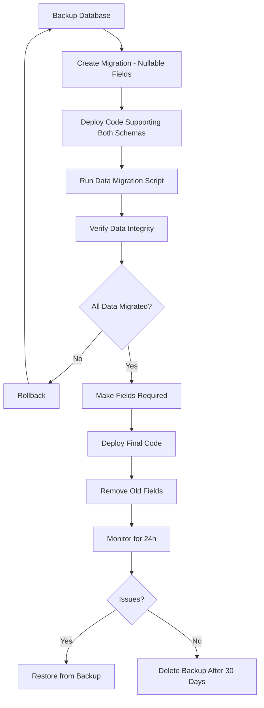

# Safe Database Migration Guide

## 🚨 Problem: Data Loss During Schema Changes

**What happened**: Running `prisma migrate reset` wiped all data because we had schema drift.

**Root cause**: The schema required non-nullable `entityId` but existing users didn't have one.

---

## ✅ Safe Migration Strategy (Zero Downtime)

### Phase 1: Make New Columns Nullable (Transition Phase)

```prisma
model User {
  id           String        @id @default(dbgenerated("gen_random_uuid()")) @db.Uuid
  email        String        @unique
  name         String?
  cooperative  String?       // Keep old field temporarily
  entityId     String?       @db.Uuid  // ← Nullable during transition
  role         UserRole?     @default(MEMBER)  // ← Nullable during transition
  createdAt    DateTime      @default(now())
  updatedAt    DateTime      @updatedAt
  auth_id      String?       @db.Uuid
  entity       Entity?       @relation(fields: [entityId], references: [id], onDelete: Cascade)
  issueRecords IssueRecord[]

  @@index([entityId])
  @@index([auth_id])
}
```

**Migration**: `npx prisma migrate dev --name add-entity-nullable`

### Phase 2: Migrate Data

Run migration script to populate new columns:

```bash
npx tsx scripts/migrate-to-entities.ts
```

This script:
1. Creates Entity for each unique `cooperative`
2. Links users to entities
3. Sets roles (first user = OWNER)
4. Migrates all related data

### Phase 3: Make Columns Required

After data migration succeeds:

```prisma
model User {
  // Remove old field
  // cooperative  String?  ← DELETE THIS LINE
  
  entityId     String        @db.Uuid  // ← Remove '?'
  role         UserRole      @default(MEMBER)  // ← Remove '?'
  // ...
}
```

**Migration**: `npx prisma migrate dev --name make-entity-required`

### Phase 4: Cleanup Old Columns

```bash
npx prisma migrate dev --name remove-cooperative-field
```

---

## 📋 Complete Safe Migration Checklist

### Before Migration

- [ ] **Backup database**
  ```bash
  # For Supabase
  pg_dump $DATABASE_URL > backup_$(date +%Y%m%d_%H%M%S).sql
  ```

- [ ] **Test migration script on copy of production data**
  ```bash
  # Clone production database to staging
  # Run migration script
  # Verify data integrity
  ```

- [ ] **Review migration SQL before applying**
  ```bash
  npx prisma migrate dev --create-only
  # Review generated SQL in prisma/migrations/
  ```

### During Migration

- [ ] **Add new columns as nullable**
- [ ] **Deploy code that works with BOTH schemas**
- [ ] **Run data migration script**
- [ ] **Verify all data migrated correctly**
- [ ] **Make columns required**
- [ ] **Remove old columns**

### After Migration

- [ ] **Monitor application logs for errors**
- [ ] **Verify user authentication works**
- [ ] **Check data integrity queries**
- [ ] **Keep backup for 30 days**

---

## 🔧 Production Migration Script Template

```typescript
// scripts/safe-migrate-to-entities.ts
import { prisma } from '@/lib/prisma';
import { generateEntityKey, encryptEntityKey } from '@/lib/entity-encryption';

async function safeMigration() {
  console.log('🔄 Starting safe migration...\n');

  // Step 1: Verify pre-conditions
  const usersWithCooperative = await prisma.user.count({
    where: { cooperative: { not: null } },
  });
  
  const usersWithEntity = await prisma.user.count({
    where: { entityId: { not: null } },
  });

  console.log(`📊 Current state:`);
  console.log(`  - Users with cooperative: ${usersWithCooperative}`);
  console.log(`  - Users with entityId: ${usersWithEntity}`);
  
  if (usersWithEntity === usersWithCooperative) {
    console.log('✅ Migration already complete!\n');
    return;
  }

  // Step 2: Dry run option
  const DRY_RUN = process.env.DRY_RUN === 'true';
  if (DRY_RUN) {
    console.log('🔍 DRY RUN MODE - No changes will be made\n');
  }

  // Step 3: Process each cooperative
  const cooperatives = await prisma.user.groupBy({
    by: ['cooperative'],
    where: {
      cooperative: { not: null },
      entityId: null, // Only migrate unmigrated users
    },
  });

  console.log(`\n🏢 Found ${cooperatives.length} cooperatives to migrate\n`);

  for (const { cooperative } of cooperatives) {
    if (!cooperative) continue;

    console.log(`Processing: "${cooperative}"`);

    if (!DRY_RUN) {
      await prisma.$transaction(async (tx) => {
        // Create entity
        const entityKey = generateEntityKey();
        const encryptedKey = encryptEntityKey(entityKey);
        
        const entity = await tx.entity.create({
          data: {
            name: cooperative,
            encryptionKey: encryptedKey,
          },
        });

        // Get users for this cooperative
        const users = await tx.user.findMany({
          where: { cooperative, entityId: null },
          orderBy: { createdAt: 'asc' },
        });

        // Update users (first one becomes OWNER)
        for (let i = 0; i < users.length; i++) {
          await tx.user.update({
            where: { id: users[i].id },
            data: {
              entityId: entity.id,
              role: i === 0 ? 'OWNER' : 'MEMBER',
            },
          });
        }

        // Migrate related data
        await tx.borrower.updateMany({
          where: { userId: { in: users.map(u => u.id) } },
          data: { entityId: entity.id },
        });

        await tx.keyType.updateMany({
          where: { userId: { in: users.map(u => u.id) } },
          data: { entityId: entity.id },
        });

        await tx.issueRecord.updateMany({
          where: { userId: { in: users.map(u => u.id) } },
          data: { entityId: entity.id },
        });

        console.log(`  ✅ Migrated ${users.length} users to entity "${entity.name}"`);
      });
    } else {
      console.log(`  [DRY RUN] Would create entity and migrate users`);
    }
  }

  // Step 4: Verification
  const finalCount = await prisma.user.count({
    where: { entityId: { not: null } },
  });
  
  console.log(`\n✅ Migration complete!`);
  console.log(`📊 Final: ${finalCount} users with entities\n`);
}

// Run with error handling
safeMigration()
  .then(() => {
    console.log('✅ Success!');
    process.exit(0);
  })
  .catch((error) => {
    console.error('❌ Migration failed:', error);
    process.exit(1);
  })
  .finally(async () => {
    await prisma.$disconnect();
  });
```

**Usage**:
```bash
# Dry run first
DRY_RUN=true npx tsx scripts/safe-migrate-to-entities.ts

# Real migration
npx tsx scripts/safe-migrate-to-entities.ts
```

---

## 🎯 Best Practices for Future Migrations

### 1. **Always Use Multi-Step Migrations for Breaking Changes**

❌ **Bad** (one-step, loses data):
```prisma
model User {
  // Removed: cooperative String
  entityId String @db.Uuid  // Added: required field
}
```

✅ **Good** (three-step, preserves data):
```prisma
// Step 1: Add new field (nullable)
entityId String? @db.Uuid

// Step 2: Migrate data (script)
// Step 3: Make required & remove old
entityId String @db.Uuid
```

### 2. **Always Backup Before Major Migrations**

```bash
# Automated backup script
#!/bin/bash
BACKUP_DIR="./backups"
TIMESTAMP=$(date +%Y%m%d_%H%M%S)
mkdir -p $BACKUP_DIR

pg_dump $DATABASE_URL > "$BACKUP_DIR/pre_migration_$TIMESTAMP.sql"
echo "✅ Backup saved: $BACKUP_DIR/pre_migration_$TIMESTAMP.sql"
```

### 3. **Test Migrations on Staging First**

```bash
# Use separate database for testing
DATABASE_URL="postgresql://..." npx prisma migrate dev
```

### 4. **Monitor Migration Progress**

```typescript
// Add progress logging
console.log(`Processed ${current}/${total} records (${percent}%)`);
```

### 5. **Make Migrations Idempotent (Re-runnable)**

```typescript
// Check if already migrated
const alreadyMigrated = await prisma.user.findFirst({
  where: { id: userId, entityId: { not: null } },
});

if (alreadyMigrated) {
  console.log('Already migrated, skipping...');
  return;
}
```

---

## 🚀 Recommended Migration Flow for Production



---

## 📝 Quick Reference Commands

### Backup
```bash
pg_dump $DATABASE_URL > backup.sql
```

### Restore
```bash
psql $DATABASE_URL < backup.sql
```

### Create Migration (Don't Apply Yet)
```bash
npx prisma migrate dev --create-only --name migration-name
```

### Apply Migration
```bash
npx prisma migrate deploy
```

### Rollback (If Needed)
```bash
# No built-in rollback in Prisma
# Must restore from backup
psql $DATABASE_URL < backup.sql
```

---

## 🎓 Key Takeaways

1. **Never make required fields in one step** - Always nullable → migrate data → required
2. **Always backup before major schema changes**
3. **Test on staging with production-like data**
4. **Make migration scripts idempotent (re-runnable)**
5. **Monitor after deployment**
6. **Keep backups for rollback**

This approach ensures **zero data loss** and **minimal downtime** for production deployments.


