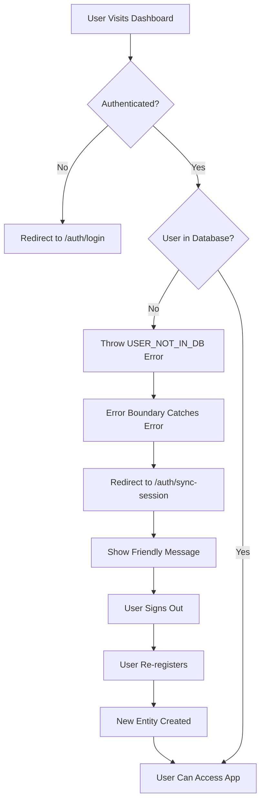

# Session Mismatch Handling

## 🎯 Problem Scenario

**Situation**: User is authenticated in Supabase Auth, but their record doesn't exist in the database.

**Common Causes**:
1. Database was reset during development
2. Migration removed user data
3. Registration process incomplete
4. Manual database cleanup without signing users out

**Error Symptoms**:
```
Error: User not found
Error: USER_NOT_IN_DB
PrismaClientKnownRequestError: User.entityId does not exist
```

---

## ✅ Solution: Graceful Error Handling Flow

### Architecture



### Implementation Components

#### 1. Enhanced Auth Utils (`lib/auth-utils.ts`)

```typescript
export async function getCurrentUser(): Promise<CurrentUser> {
  const supabase = await createClient();
  const { data: { user }, error } = await supabase.auth.getUser();
  
  if (error || !user?.email) {
    throw new Error('Not authenticated');
  }

  // Dual lookup: auth_id → email fallback
  let dbUser = await prisma.user.findUnique({
    where: { auth_id: user.id },
    select: { id: true, entityId: true, role: true, email: true, name: true },
  });

  if (!dbUser) {
    dbUser = await prisma.user.findUnique({
      where: { email: user.email },
      select: { id: true, entityId: true, role: true, email: true, name: true },
    });
  }
  
  if (!dbUser) {
    throw new Error('USER_NOT_IN_DB'); // ← Specific error for error boundary
  }
  
  return dbUser;
}
```

**Why dual lookup?**
- Primary: `auth_id` (set during email/password registration)
- Fallback: `email` (for OAuth users or legacy data)

#### 2. Global Error Boundary (`app/error.tsx`)

```typescript
'use client';

export default function Error({ error, reset }: {
  error: Error & { digest?: string };
  reset: () => void;
}) {
  const isUserNotFound = error.message === 'USER_NOT_IN_DB';
  
  if (isUserNotFound) {
    // Auto-redirect to session sync page
    window.location.href = '/auth/sync-session';
    return null;
  }

  // Handle other errors...
}
```

**Catches all unhandled errors in the app** and provides appropriate redirects.

#### 3. Session Sync Page (`app/auth/sync-session/page.tsx`)

User-friendly page that:
- ✅ Explains what happened in plain language
- ✅ Shows the authenticated email
- ✅ Provides one-click solution (sign out → re-register)
- ✅ Lists common causes

**User sees**:
```
⚠️ Session Mismatch

Your authentication session is active, but your user 
profile is missing from the database.

Logged in as: user@example.com

This usually happens when:
• The database was reset during development
• Your registration wasn't completed

To fix this:
1. Sign out from your current session
2. Register again with the same or a new email
3. Complete your organization setup

[Sign Out and Register Again]
```

#### 4. User Existence Check API (`app/api/check-user-exists/route.ts`)

```typescript
export async function POST(req: NextRequest) {
  const { email } = await req.json();
  
  const user = await prisma.user.findUnique({
    where: { email },
    select: { id: true },
  });

  return NextResponse.json({ exists: !!user });
}
```

Used by sync page to verify user doesn't exist in database.

---

## 🔄 User Journey

### Before Fix (Bad UX)
```
1. User logs in ✅
2. Navigate to dashboard
3. Error: "User not found" ❌
4. White screen or generic error
5. User confused, doesn't know what to do
```

### After Fix (Good UX)
```
1. User logs in ✅
2. Navigate to dashboard
3. Error caught automatically
4. Redirected to friendly explanation page ✅
5. Clear instructions shown
6. One-click solution: Sign out → Re-register
7. User completes registration
8. User can access app ✅
```

---

## 🧪 Testing the Flow

### Simulate the Problem

```bash
# 1. Register a user
# Visit /auth/register and create account

# 2. Reset database (simulates production data loss)
npx prisma migrate reset --force --skip-seed

# 3. Try to access dashboard while still logged in
# Visit /active-loans

# Expected: Redirect to /auth/sync-session with friendly message
```

### Verify the Fix

1. **See session sync page** ✅
2. **Clear explanation displayed** ✅
3. **Click "Sign Out and Register Again"** ✅
4. **Re-register with same or new email** ✅
5. **Access dashboard successfully** ✅

---

## 🛠️ Development Scenarios

### Scenario 1: Database Reset During Dev

**Problem**: Developer runs `prisma migrate reset`, all data wiped.

**Solution**: 
- Existing logged-in users see sync page
- Must re-register to continue
- No confusing errors

### Scenario 2: Migration Fails Halfway

**Problem**: Schema updated but data migration script didn't run.

**Solution**:
- Users without `entityId` trigger USER_NOT_IN_DB
- Sync page shown
- Developer can fix migration and users re-register

### Scenario 3: Manual Database Cleanup

**Problem**: Admin deletes users from database without invalidating auth sessions.

**Solution**:
- Deleted users see sync page on next visit
- Must re-register
- Clear path forward

---

## 📋 Best Practices

### For Developers

1. **Test with logged-in session after DB changes**
   ```bash
   # Stay logged in while testing migrations
   # Verify sync page appears if user deleted
   ```

2. **Always communicate database resets**
   ```bash
   # In team chat:
   "🔄 Database reset - please re-register if you get errors"
   ```

3. **Use safe migration scripts in production**
   ```bash
   # Follow SAFE-MIGRATION-GUIDE.md
   # Never reset in production
   ```

### For Production

1. **Monitor USER_NOT_IN_DB errors**
   ```typescript
   // In error tracking (e.g., Sentry)
   if (error.message === 'USER_NOT_IN_DB') {
     Sentry.captureMessage('User in auth but not database', 'warning');
   }
   ```

2. **Add recovery mechanism**
   ```typescript
   // Future enhancement: Auto-create user record
   // If user exists in auth but not DB, create placeholder
   ```

3. **Keep backups**
   ```bash
   # Always backup before migrations
   pg_dump $DATABASE_URL > backup.sql
   ```

---

## 🎯 Key Takeaways

### What We Fixed

| Before | After |
|--------|-------|
| Generic "User not found" error | Friendly sync page with explanation |
| No recovery path | Clear one-click solution |
| Developer must debug | User can self-service |
| Auth/DB state out of sync crashes app | Graceful handling with redirect |

### Files Modified

1. ✅ `lib/auth-utils.ts` - Enhanced user lookup
2. ✅ `app/error.tsx` - Global error boundary
3. ✅ `app/auth/sync-session/page.tsx` - User-facing sync page
4. ✅ `app/api/check-user-exists/route.ts` - API endpoint

### Benefits

- ✅ **Better UX**: Users know exactly what to do
- ✅ **Reduced Support**: Self-service resolution
- ✅ **Clearer Debugging**: Specific error codes
- ✅ **Production Ready**: Handles edge cases gracefully

---

## 🔮 Future Enhancements

### Auto-Recovery (Optional)

```typescript
// lib/auth-utils.ts
if (!dbUser && user?.email) {
  // Auto-create user with default entity
  dbUser = await prisma.user.create({
    data: {
      email: user.email,
      auth_id: user.id,
      entityId: await getOrCreateDefaultEntity(),
      role: 'MEMBER',
    },
  });
}
```

### Admin Dashboard

```typescript
// Show users in auth but not in database
const orphanedUsers = await getOrphanedAuthUsers();
// Allow admin to either:
// 1. Create database records
// 2. Delete auth accounts
```

### Automatic Session Cleanup

```bash
# Cron job: Sign out users without database records
# Prevents confusion from orphaned auth sessions
```

---

This comprehensive error handling ensures **zero confusion** for users when database and auth state get out of sync!


